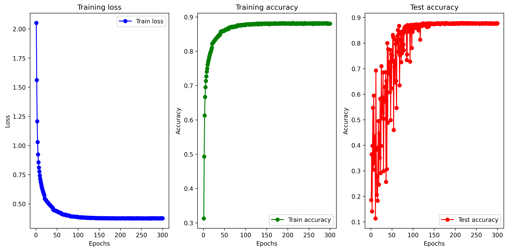

# LLM GDL Base
Pytorchに基づいたプロジェクトを実践する

## I: GNN4Img
- Implemented Stride and Padding for [graph convolutional operator (GCNConv)](https://pytorch-geometric.readthedocs.io/en/2.5.1/generated/torch_geometric.nn.conv.GCNConv.html#torch_geometric.nn.conv.GCNConv) layer in PyTorch Geometric.
- Dataset:
    - MNIST
- Baselines:
    - CNN Net1: Vanilla 3X3 CNN 
    - CNN Net2: CNN Net1 with BatchNorm 
    - CNN Net3: CNN Net2 with ResNet
- Results:
  - Performance of Modified GCNConv-Net with Stride and Padding (GCN_Net3 in gnn_model.py):
  
    
    
  - Performance of the GIN-Net (graph isomorphism operator):
  
    

